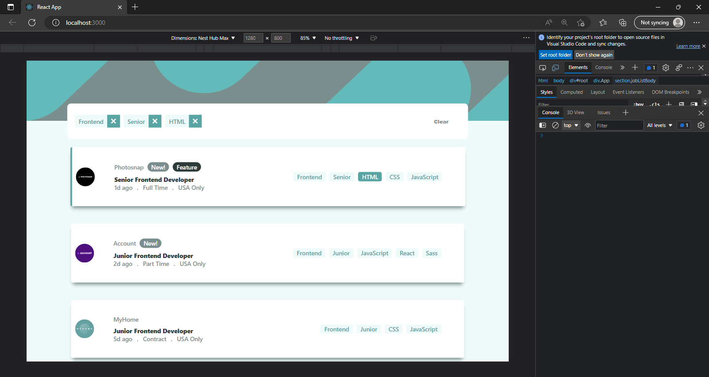
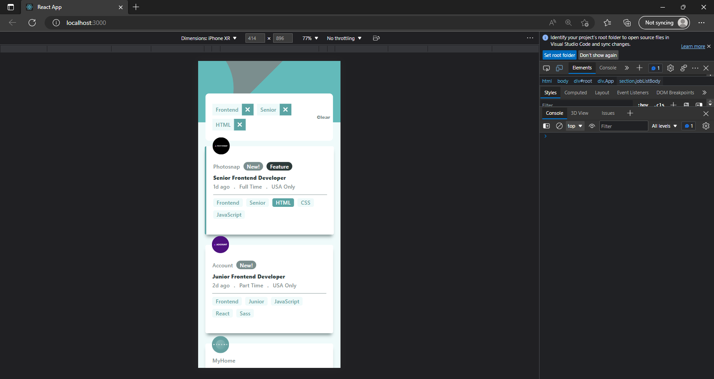

# Frontend Mentor - Job listings with filtering solution

This is a solution to the [Job listings with filtering challenge on Frontend Mentor](https://www.frontendmentor.io/challenges/job-listings-with-filtering-ivstIPCt). Frontend Mentor challenges help you improve your coding skills by building realistic projects. 

## Table of contents

- [Overview](#overview)
  - [The challenge](#the-challenge)
  - [Screenshot](#screenshot)
- [My process](#my-process)
  - [Built with](#built-with)
  - [What I learned](#what-i-learned)
- [Author](#author)

**Note: Delete this note and update the table of contents based on what sections you keep.**

## Overview

### The challenge

Users should be able to:

- View the optimal layout for the site depending on their device's screen size
- See hover states for all interactive elements on the page
- Filter job listings based on the categories

### Screenshot

## My process

### Built with

- Semantic HTML5 markup
- CSS custom properties
- Flexbox
- CSS Grid
- Web-first workflow
- [React](https://reactjs.org/) - JS library

### What I learned

I learnt more about hte useEffect hook, also learnt more on the passing of JSON

## Author

- Mail - [nkemakolammartin](nkemakolammartin@gmail.com)
- Frontend Mentor - [@martinnkemakolam](https://www.frontendmentor.io/profile/@martinnkemakolam)
- Twitter - [@MartinNkemakol1](https://www.twitter.com/@MartinNkemakol1)
